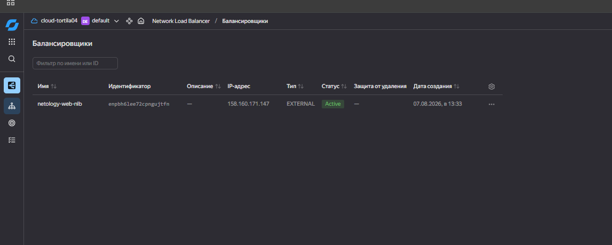
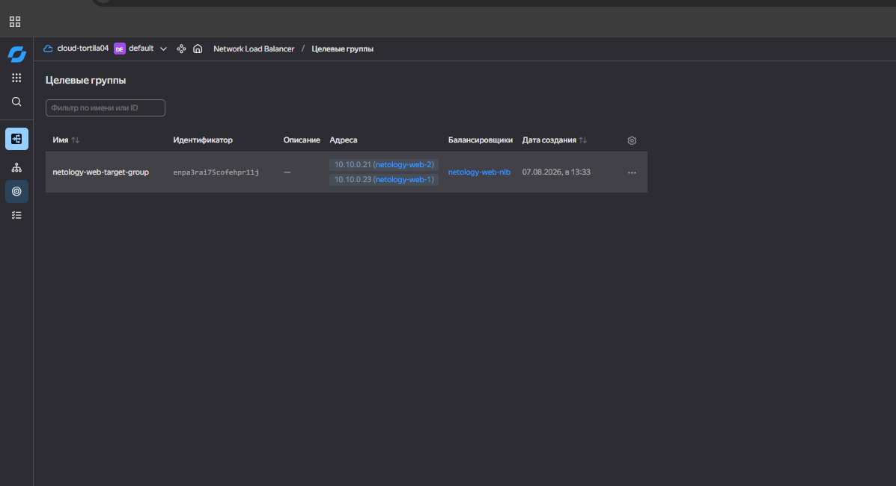
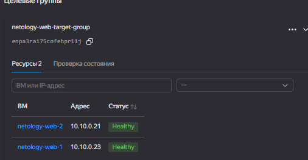
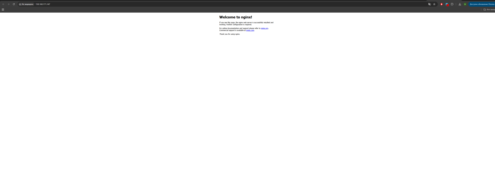

# Домашнее задание: балансировщик нагрузки в Yandex Cloud

**Фамилия и имя:** Богданов Богдан

Terraform-конфигурация создаёт две одинаковые VM c Nginx, target group из их внутренних IP-адресов и внешний Network Load Balancer. Балансировщик принимает HTTP на TCP-порту `80`, направляет его на порт `80` VM и проверяет `GET /` на порту `80`.

## Перед запуском

1. В консоли Yandex Cloud создайте сервисный аккаунт и назначьте ему роль `editor` на каталог. Затем создайте для него **авторизованный ключ** и сохраните скачанный JSON-файл вне репозитория.
2. Скопируйте `terraform.tfvars.example` в `terraform.tfvars` и внесите `cloud_id` и `folder_id`.
3. В PowerShell укажите путь к JSON-ключу только для текущего окна:

   ```powershell
   $env:YC_SERVICE_ACCOUNT_KEY_FILE = "C:\\Users\\<user>\\Downloads\\key.json"
   ```

4. Выполните:

   ```powershell
   $env:TF_CLI_CONFIG_FILE = (Resolve-Path "terraform.rc")
   terraform init
   terraform fmt -check
   terraform validate
   terraform apply
   ```

4. Откройте IP из вывода `load_balancer_external_ip` в браузере: `http://<IP>/`.

## Результаты проверки

Внешний IP-адрес балансировщика: [http://158.160.171.147/](http://158.160.171.147/).

### Статус балансировщика

Балансировщик `netology-web-nlb` находится в статусе `Active`.



### Целевая группа

В группе `netology-web-target-group` зарегистрированы две виртуальные машины: `netology-web-1` и `netology-web-2`.



Обе VM прошли HTTP health check и находятся в статусе `Healthy`.



### Проверка Nginx

При обращении к внешнему IP балансировщика на порту `80` открывается стандартная страница Nginx.


